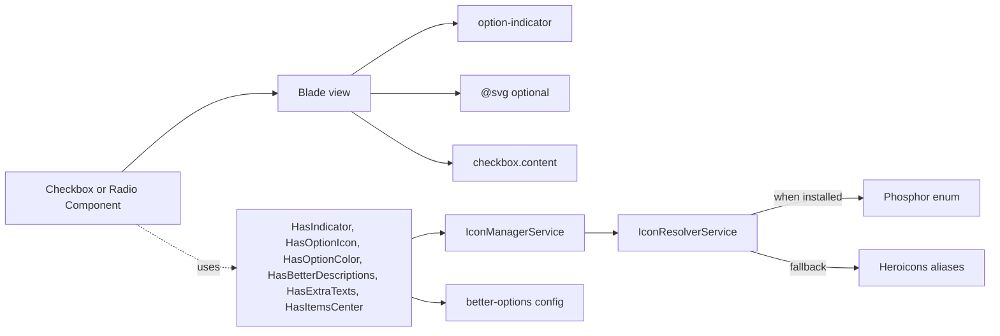

# Architecture

This document describes the real architecture of `tonegabes/filament-better-options` as implemented in the source code.

## High-level overview



## Components

Eight form components are provided, split in two families and four styles:

| Family   | List            | Cards           | StackedCards           | Table           |
| -------- | --------------- | --------------- | ---------------------- | --------------- |
| Checkbox | `CheckboxList`  | `CheckboxCards` | `CheckboxStackedCards` | `CheckboxTable` |
| Radio    | `RadioList`     | `RadioCards`    | `RadioStackedCards`    | `RadioTable`    |

Each component is a thin subclass of the Filament native `CheckboxList`/`Radio` (or a `Field` for `RadioCards`/`RadioStackedCards`/`RadioTable` where `HasColumns` is required) that applies additional traits and sets its view plus a pair of `{componentType, componentStyle}` for default resolution.

## Traits (`src/Concerns/`)

| Trait                     | Responsibility                                                                   |
| ------------------------- | -------------------------------------------------------------------------------- |
| `HasBetterDescriptions`   | Extends Filament's descriptions with a visibility toggle (`hiddenDescription`).  |
| `HasExtraTexts`           | Optional "extra" text per option, pulled from array or from `HasExtraText` enum. |
| `HasIndicator`            | Idle/selected indicator icons + position + visibility/partial visibility.        |
| `HasItemsCenter`          | Vertical alignment of items inside cards.                                        |
| `HasOptionIcon`           | Icon per option + position + visibility.                                         |
| `HasOptionColor`          | Per-option tint via `Filament\Support\Contracts\HasColor` on enums.              |

All visibility toggles accept `Closure` evaluation via Filament's `evaluate()`.

## Enums (`src/Enums/`)

- `ComponentTypes`: `Checkbox`, `Radio`.
- `ComponentStyles`: `List`, `Cards`, `StackedCards`, `Table`.

These are used together by `IconManagerService`, `HasIndicator` and `HasOptionIcon` to look up configuration defaults like icon/indicator positions per `{componentType, componentStyle}` combination.

## Services (`src/Services/`)

- `IconResolverService`: detects whether `tonegabes/filament-phosphor-icons` is installed and, if not, falls back to Heroicons aliases. Consumers can register custom defaults via `config('better-options.icons.defaults')`.
- `IconManagerService`: resolves the idle/selected indicator icon for a given `ComponentTypes` + state (`idle`/`selected`), delegating to `IconResolverService` and supporting Filament `FilamentIcon::resolve()` aliases.

## Contracts (`src/Contracts/`)

- `HasExtraText`: optional enum-level contract for providing an "extra" string per case.

## Configuration (`config/better-options.php`)

```php
return [
    'components' => [
        'checkbox' => [
            'list'          => [ 'icon_position' => 'after',  'indicator_position' => 'before' ],
            'cards'         => [ 'icon_position' => 'before', 'indicator_position' => 'after'  ],
            'stacked_cards' => [ 'icon_position' => 'before', 'indicator_position' => 'after'  ],
            'table'         => [ 'icon_position' => 'after',  'indicator_position' => 'before' ],
        ],
        'radio' => [ /* same shape */ ],
    ],
    'icons' => [
        'defaults' => [
            // optional overrides of the built-in icon set
            // 'checkbox_idle' => 'heroicon-o-square',
        ],
    ],
];
```

## Blade views (`resources/views/components/`)

- Shared subcomponents: `option-indicator`, `search-input`, `bulk-actions`, `checkbox/content`.
- Per component: `checkbox/list.blade.php`, `checkbox/cards.blade.php`, `checkbox/stacked-cards.blade.php`, `checkbox/table.blade.php` and the radio counterparts.

## JavaScript (`resources/js/better-checkbox.js`)

Alpine component registered as `checkboxListFormComponent`:

- Caches DOM selectors.
- Debounces search input (150ms).
- Batches DOM operations for bulk toggle.
- Listens to Livewire `commit` hook to re-index options after updates.

Registered via `FilamentAsset::register()` with `loadedOnRequest()` to avoid eager loading on unrelated pages.

## Styling (`resources/css/`)

Plain Tailwind 4 CSS files per style, compiled into `resources/dist/better-options.css` which is registered with `FilamentAsset`.

## Testing

The package ships with a Pest test suite under `tests/`:

- `tests/Unit/`: trait-level tests for indicators, icons, extra texts, color resolution.
- `tests/Feature/`: one test per component + a theme smoke test.
- `tests/Fixtures/RolesEnum.php`: fixture implementing `HasLabel`, `HasDescription`, `HasIcon`, `HasColor`, `HasExtraText`.

`orchestra/testbench` is used to bootstrap a minimal Laravel + Filament environment.
